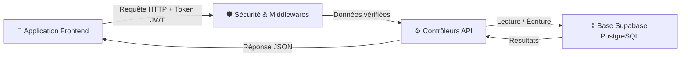

# 🏥 Plan de Travail Récapitulatif - Backend (Gestion de Clinique)

> **Objectif du document** : Présenter de manière simple, ordonnée et facile à comprendre toute l'architecture du serveur backend construit avec **Node.js, Express et Supabase (PostgreSQL)**.

Le document complet est disponible dans :
👉 [server/PLAN_DE_TRAVAIL_BACKEND.md](file:///home/mazamalfn/Documents/projets/clinic/gestion-clinique/server/PLAN_DE_TRAVAIL_BACKEND.md)

---

## 🎯 1. En résumé : Comment fonctionne le Backend ?

Le backend est le **cerveau de l'application**. Il s'occupe de recevoir les demandes du frontend (l'interface utilisateur), de vérifier que l'utilisateur a le droit d'effectuer l'action, de dialoguer avec la base de données Supabase et de renvoyer les réponses adaptées.



---

## 🗺️ 2. Feuille de Route Chronologique (Les 5 Étapes du Projet)

---

### 🗄️ Étape 1 : La Base de Données (La Mémoire de la Clinique)
*Création de la structure des tables PostgreSQL sur Supabase et jeu de données de test.*

- **Ce qui a été fait** :
  - **Structure des tables** : 6 tables reliées entre elles avec identifiants uniques (UUID) et mises à jour automatiques des dates (`updated_at`).
  - **Données initiales** : Insertion d'utilisateurs par défaut (Admin, Médecins, Secrétaire), de patients de test et de rendez-vous.
- **Fichiers clés** :
  - [schema.sql](file:///home/mazamalfn/Documents/projets/clinic/gestion-clinique/supabase/schema.sql) : Le plan de construction de la base de données.
  - [seed.sql](file:///home/mazamalfn/Documents/projets/clinic/gestion-clinique/supabase/seed.sql) : Les données de test prêtes à l'emploi.

---

### ⚙️ Étape 2 : L'Infrastructure Serveur & Configuration
*Mise en place du serveur web Node.js / Express.*

- **Ce qui a été fait** :
  - Configuration du serveur HTTP ([index.js](file:///home/mazamalfn/Documents/projets/clinic/gestion-clinique/server/index.js) et [app.js](file:///home/mazamalfn/Documents/projets/clinic/gestion-clinique/server/src/app.js)).
  - Connexion sécurisée à Supabase via la clé d'administration ([supabase.js](file:///home/mazamalfn/Documents/projets/clinic/gestion-clinique/server/src/config/supabase.js)).
  - Centralisation des variables d'environnement dans [.env](file:///home/mazamalfn/Documents/projets/clinic/gestion-clinique/server/.env) et [env.js](file:///home/mazamalfn/Documents/projets/clinic/gestion-clinique/server/src/config/env.js).
  - Route d'état de santé du serveur (`GET /api/health`).

---

### 🛡️ Étape 3 : Sécurité & Protection de l'API
*Filtrage des accès et contrôle des permissions.*

- **Ce qui a été fait** :
  - **Authentification par Token JWT** ([auth.middleware.js](file:///home/mazamalfn/Documents/projets/clinic/gestion-clinique/server/src/middleware/auth.middleware.js)) : Bloque l'accès aux personnes non connectées.
  - **Gestion des Rôles RBAC** ([rbac.middleware.js](file:///home/mazamalfn/Documents/projets/clinic/gestion-clinique/server/src/middleware/rbac.middleware.js)) : Vérifie si le rôle (Admin, Médecin, Secrétaire) a le droit d'effectuer l'action.
  - **Validation des données transmises** ([schemas.js](file:///home/mazamalfn/Documents/projets/clinic/gestion-clinique/server/src/validators/schemas.js) & [validate.middleware.js](file:///home/mazamalfn/Documents/projets/clinic/gestion-clinique/server/src/middleware/validate.middleware.js)) : Empêche l'envoi de formulaires invalides ou incomplets.
  - **Gestion centralisée des erreurs** ([error.middleware.js](file:///home/mazamalfn/Documents/projets/clinic/gestion-clinique/server/src/middleware/error.middleware.js)) : Évite les plantages du serveur et renvoie des messages clairs.

---

### 📦 Étape 4 : Les 7 Modules Fonctionnels (L'API REST)
*Développement des fonctionnalités de l'application.*

#### 1️⃣ 🔑 Authentification (`/api/auth`)
- **Rôle** : Permet aux utilisateurs de se connecter et de récupérer leur profil.
- **Fichiers** : [auth.controller.js](file:///home/mazamalfn/Documents/projets/clinic/gestion-clinique/server/src/controllers/auth.controller.js) | [auth.routes.js](file:///home/mazamalfn/Documents/projets/clinic/gestion-clinique/server/src/routes/auth.routes.js)

#### 2️⃣ 👥 Gestion du Personnel (`/api/users`)
- **Rôle** : Créer, modifier, lister et supprimer les comptes du personnel (Admin uniquement).
- **Fichiers** : [user.controller.js](file:///home/mazamalfn/Documents/projets/clinic/gestion-clinique/server/src/controllers/user.controller.js) | [user.routes.js](file:///home/mazamalfn/Documents/projets/clinic/gestion-clinique/server/src/routes/user.routes.js)

#### 3️⃣ 🏥 Gestion des Patients (`/api/patients`)
- **Rôle** : Créer les dossiers patients, rechercher (`?q=`), consulter la fiche complète avec tout l'historique médical (RDV + consultations + ordonnances).
- **Fichiers** : [patient.controller.js](file:///home/mazamalfn/Documents/projets/clinic/gestion-clinique/server/src/controllers/patient.controller.js) | [patient.routes.js](file:///home/mazamalfn/Documents/projets/clinic/gestion-clinique/server/src/routes/patient.routes.js)

#### 4️⃣ 📅 Gestion des Rendez-vous (`/api/appointments`)
- **Rôle** : Planifier des RDV, filtrer par date ou médecin, et changer rapidement le statut (`planifie` ➔ `en_cours` ➔ `honore` / `annule`).
- **Fichiers** : [appointment.controller.js](file:///home/mazamalfn/Documents/projets/clinic/gestion-clinique/server/src/controllers/appointment.controller.js) | [appointment.routes.js](file:///home/mazamalfn/Documents/projets/clinic/gestion-clinique/server/src/routes/appointment.routes.js)

#### 5️⃣ 🩺 Consultations Médicales (`/api/consultations`)
- **Rôle** : Saisie et consultation des comptes-rendus de consultation (motif, diagnostic, notes du médecin).
- **Fichiers** : [consultation.controller.js](file:///home/mazamalfn/Documents/projets/clinic/gestion-clinique/server/src/controllers/consultation.controller.js) | [consultation.routes.js](file:///home/mazamalfn/Documents/projets/clinic/gestion-clinique/server/src/routes/consultation.routes.js)

#### 6️⃣ 💊 Ordonnances & Médicaments (`/api/prescriptions`)
- **Rôle** : Rédaction des prescriptions associées à une consultation avec ajout de la liste des médicaments et posologies.
- **Fichiers** : [prescription.controller.js](file:///home/mazamalfn/Documents/projets/clinic/gestion-clinique/server/src/controllers/prescription.controller.js) | [prescription.routes.js](file:///home/mazamalfn/Documents/projets/clinic/gestion-clinique/server/src/routes/prescription.routes.js)

#### 7️⃣ 📊 Tableau de bord & Statistiques (`/api/dashboard`)
- **Rôle** : Fournir les chiffres clés en temps réel (nombre total de patients, de médecins, RDV du jour, consultations du jour et liste des prochains RDV).
- **Fichiers** : [dashboard.controller.js](file:///home/mazamalfn/Documents/projets/clinic/gestion-clinique/server/src/controllers/dashboard.controller.js) | [dashboard.routes.js](file:///home/mazamalfn/Documents/projets/clinic/gestion-clinique/server/src/routes/dashboard.routes.js)

---

### 📖 Étape 5 : Documentation & Manuel de Prise en Main
*Rédaction de la documentation pour l'équipe de développement et le frontend.*

- **Ce qui a été fait** : Création du fichier [API_DOCS.md](file:///home/mazamalfn/Documents/projets/clinic/gestion-clinique/server/API_DOCS.md) qui contient les exemples de requêtes JSON, les codes d'accès de démo et les explications d'installation.

---

## 🔒 3. Matrice des Permissions (Qui a accès à quoi ?)

| Fonctionnalité / Module | Admin | Médecin | Secrétaire |
| :--- | :---: | :---: | :---: |
| **Connexion & Mon Profil** | ✅ | ✅ | ✅ |
| **Gestion du Personnel** | ✅ | ❌ | ❌ |
| **Gestion des Patients** | ✅ | ✅ | ✅ |
| **Prise & Suivi de Rendez-vous** | ✅ | ✅ | ✅ |
| **Consulter les Consultations** | ✅ | ✅ | ✅ |
| **Créer des Consultations** | ✅ | ✅ | ❌ |
| **Gérer les Ordonnances** | ✅ | ✅ | ❌ |
| **Voir le Tableau de Bord** | ✅ | ✅ | ✅ |

---

## 📁 4. Organisation des Dossiers Expliquée Simplement

```text
server/src/
├── config/        👉 Fichiers de configuration (Supabase, variables .env)
├── controllers/   👉 La logique métier (Traitement des données de chaque module)
├── middleware/    👉 La sécurité (Vérification du Token JWT, des rôles et des erreurs)
├── routes/        👉 Les liens/URLs de l'API (Routage HTTP)
└── validators/    👉 Les règles de contrôle des formulaires reçus (Zod)
```
